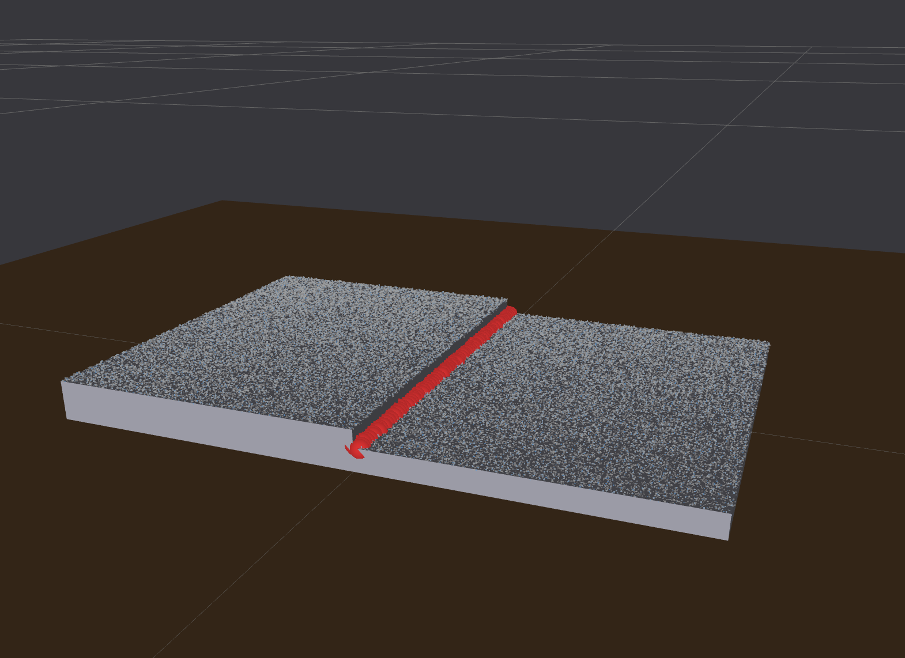

# weld_seam_ros2

ROS 2 (Jazzy) package for weld-seam detection on a lap-joint part. Publishes a static inspection scene (table, mesh, point cloud) and provides two interchangeable seam-detector nodes that run purely for visualisation in RViz2 — no robot arm or camera transform logic.

---

## Package layout

```text
weld_seam_ros2/
├── weld_seam_ros2/
│   ├── scene_publisher_node.py         — Publishes table, part mesh and point cloud
│   ├── seam_detector_node.py           — Detector A: asymmetry feature + B-spline pipeline
│   └── lap_joint_seam_detector_node.py — Detector B: height-split / XY-proximity pipeline
├── launch/
│   ├── view_scene.launch.py            — Scene publisher + RViz2
│   └── detector.launch.py              — Seam detector (choice: default | lap_joint)
├── rviz/
│   └── scene.rviz                      — RViz2 display config
├── assets/
│   ├── lap_joint_test.stl              — Lap-joint mesh (part only)
│   ├── lap_joint_test.pcd              — Captured point cloud (part only)
│   ├── lap_joint_base_frame.pcd        — Captured point cloud in base frame
│   └── lap_joint_with_table.pcd        — Captured point cloud including table surface
└── reference/                          — Original ROS 1 scripts this was ported from
```

---

## Dependencies

### ROS 2 packages

```bash
sudo apt install \
  ros-jazzy-sensor-msgs-py \
  ros-jazzy-rviz2 \
  ros-jazzy-tf2-ros
```

### Python packages

```bash
pip install open3d numpy scipy vg
```

---

## Build

```bash
cd ~/ws/robotics/ros2/welding_ws
colcon build --packages-select weld_seam_ros2
source install/setup.bash
```

---

## Run

Detection runs fully automatically — no service calls required.

### Terminal 1 — scene + RViz2

```bash
ros2 launch weld_seam_ros2 view_scene.launch.py
```

### Terminal 2 — seam detector

```bash
# Lap-joint height-split detector (recommended for this dataset)
ros2 launch weld_seam_ros2 detector.launch.py detector:=lap_joint

# Asymmetry + B-spline detector (general-purpose)
ros2 launch weld_seam_ros2 detector.launch.py
```

RViz2 opens with Fixed Frame `world` and shows all layers simultaneously:

| Layer | Colour | Source topic |
|---|---|---|
| Table + part mesh | grey | `/scene/markers` |
| Part point cloud | light grey | `/scene/points` |
| Downsampled cloud | blue | `/seam/downsampled_cloud` |
| Detected groove | red spheres | `/seam/groove_cloud` |
| Trajectory cloud | green | `/seam/trajectory_cloud` *(default detector only)* |
| Seam poses | axes | `/seam/trajectory_poses` *(default detector only)* |
| Seam markers | line + arrow | `/seam/markers` *(default detector only)* |

---

## Topics

### Input

| Topic | Type | Publisher |
|---|---|---|
| `/scene/points` | `sensor_msgs/PointCloud2` | `scene_publisher` |
| `/scene/markers` | `visualization_msgs/MarkerArray` | `scene_publisher` |

### Output — both detectors

| Topic | Type | Description |
|---|---|---|
| `/seam/downsampled_cloud` | `sensor_msgs/PointCloud2` | Voxel-downsampled, depth-filtered cloud |
| `/seam/groove_cloud` | `sensor_msgs/PointCloud2` | Detected seam cluster |

### Output — default detector only

| Topic | Type | Description |
|---|---|---|
| `/seam/trajectory_cloud` | `sensor_msgs/PointCloud2` | B-spline smoothed trajectory points |
| `/seam/trajectory_poses` | `geometry_msgs/PoseArray` | Oriented torch poses along the seam |
| `/seam/markers` | `visualization_msgs/MarkerArray` | Line-strip + start-direction arrow |

---

## Detectors

### `detector:=lap_joint` — `lap_joint_seam_detector_node.py`

Designed specifically for lap joints. Exploits the bimodal Z distribution (two flat plates at different heights) to locate the seam without normal estimation or asymmetry features — both of which struggle on flat surfaces due to sensor noise.

#### Detection pipeline (height-split)

1. Voxel downsample + Z clip (`max_depth`)
2. Split cloud into upper / lower height groups via 1-D two-means on Z
3. Retain points whose XY position is within `edge_radius` of the opposite group — these are step-edge candidates
4. DBSCAN on candidates → largest cluster = seam

#### Parameters (lap_joint)

| Parameter | Default | Description |
|---|---|---|
| `frame_id` | `world` | Output frame |
| `voxel_size` | `0.002` m | Voxel grid spacing |
| `max_depth` | `0.7` m | Z clip — discard points above this height |
| `edge_radius` | `0.003` m | XY proximity threshold. Rule: ≈ `voxel_size`. Decrease if the whole surface is selected; increase if no candidates are found |
| `min_cluster_pts` | `10` | DBSCAN minimum cluster size |
| `seam_group` | `lower` | Which plate's edge to return: `lower` (weld foot, default), `upper`, or `both` |
| `process_interval` | `5.0` s | Minimum seconds between successive detections |
| `verbose` | `false` | Log per-step point counts for parameter tuning |



#### Tuning guide

```text
Whole surface turns red  →  decrease edge_radius (try 0.001)
No candidates found      →  increase edge_radius (try 0.005)
Two parallel red lines   →  set seam_group:=lower (keeps weld-foot line only)
Wrong Z split            →  adjust max_depth to exclude background points
```

---

### `detector:=default` — `seam_detector_node.py`

General-purpose groove detector ported from the original ROS 1 pipeline. Suitable for V-grooves, T-joint fillets, and other continuous-curvature geometries.

#### Detection pipeline (asymmetry + B-spline)

1. Voxel downsample + depth filter
2. Normal estimation, oriented upward (+Z)
3. Asymmetry feature extraction → high-asymmetry points near the seam
4. Z-band filter → keep only points at the step-edge height band
5. DBSCAN → largest cluster by XY span = groove candidate
6. `thin_line` → project groove points onto local regression lines
7. `sort_points` → order thinned points along the seam
8. B-spline fit (pass 1) → smooth, dense trajectory
9. Cylinder filter → refine groove points inside trajectory
10. `thin_line` + `sort_points` + B-spline (pass 2) → final trajectory
11. Surface-normal estimation via RANSAC plane fit → torch orientation

#### Parameters (default)

| Parameter | Default | Description |
|---|---|---|
| `frame_id` | `world` | Output frame |
| `voxel_size` | `0.003` m | Voxel grid spacing |
| `max_depth` | `5.0` m | Depth clip on Z axis |
| `delete_percentage` | `0.85` | Fraction of low-asymmetry points discarded (keeps top 15 %) |
| `z_band_fraction` | `0.35` | Fraction of Z range kept above the step edge. Increase if seam sits mid-height |
| `neighbor_radius` | `0.006` m | DBSCAN eps. Rule: ≈ 2× `voxel_size` |
| `thin_radius` | `0.010` m | Neighbourhood radius for `thin_line` SVD. Rule: ≈ 3× `voxel_size` |
| `sort_distance` | `0.004` m | Walk step size for `sort_points`. Rule: ≈ 1.5× `voxel_size` |
| `process_interval` | `5.0` s | Minimum seconds between successive detections |

---

## Parameters — `scene_publisher` node

| Parameter | Default | Description |
|---|---|---|
| `frame_id` | `world` | Fixed frame for all published data |
| `mesh_path` | *(installed assets dir)* | Path to the STL mesh file |
| `pcd_path` | *(installed assets dir)* | Path to the point cloud file |
| `table_width` | `0.6` m | Table size along X |
| `table_depth` | `0.6` m | Table size along Y |
| `table_height` | `0.05` m | Table thickness; top surface is always at Z = 0 |
| `publish_rate` | `2.0` Hz | Cloud and marker publish rate |

To use a different point cloud (e.g. the scan that includes the table surface):

```bash
ros2 run weld_seam_ros2 scene_publisher \
  --ros-args -p pcd_path:=/path/to/lap_joint_with_table.pcd
```
